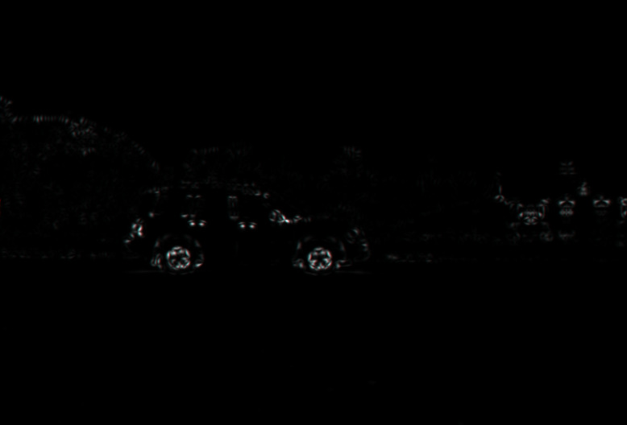

# Harris corner detector

## Preliminary
- Images are from Cornell's image processing course 
	- https://www.cs.cornell.edu/courses/cs664/2003fa/images/
- Helpful pdf to learn theory for Harris Corner Detection algorithm from CMU
	- https://www.cs.cmu.edu/~16385/s17/Slides/6.2_Harris_Corner_Detector.pdf

## Results (9/29/2024)

<table>
<tr>
<th> Original Image from sage_1.ppm</th>
<th> Edges with no threshold</th>
</tr>
<tr>
<th> Original Image from car_1.ppm</th>
<th> Edges with no threshold</th>
</tr>
</table>

I made a slideshow about this: [slideshow](https://docs.google.com/presentation/d/1gGY89pJ000mCDPW12djSILQ97Z5pinJXMIT3WELiA3I/edit?usp=sharing)

The slideshow include information on:
	- Motivation
	- CUDA intro
	- Implementation with CUDA
	- Benchmark results